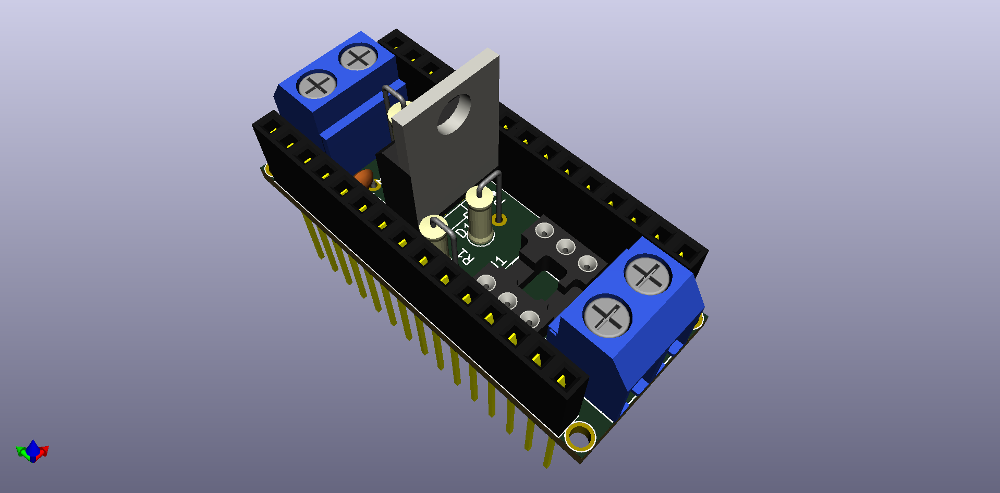
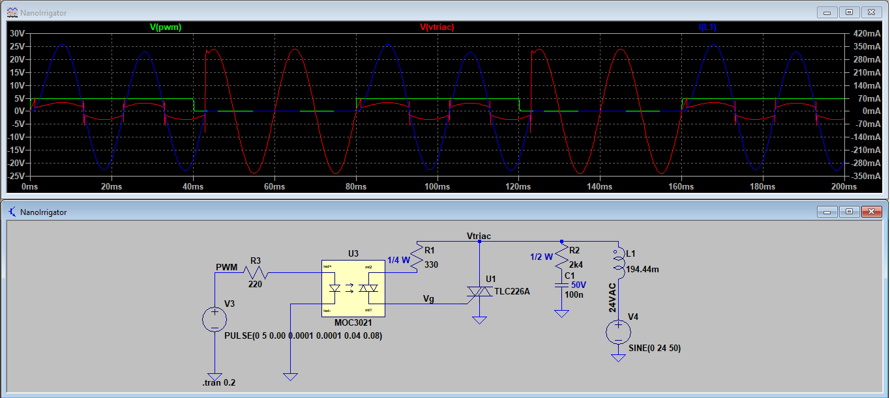
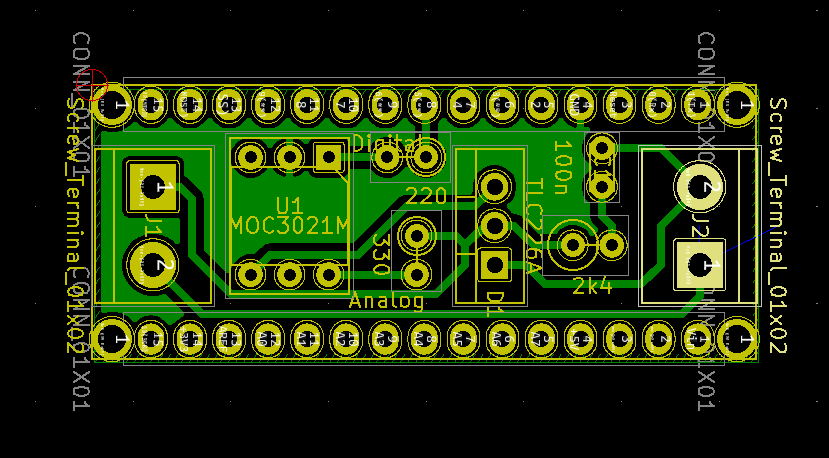

# NanoIrrigator
A small Arduino Nano PCB shield for controlling solenoid valves for irrigation systems.

The current design is for a single channel, but may be expanded to more channels if there exists more space.

## Main features
* Single-sided PCB for CNC milling.
* 24VAC solenoid valve control with TRIAC and opto-isolator.
* Snubber circuit.

## Pics

    

    

    

